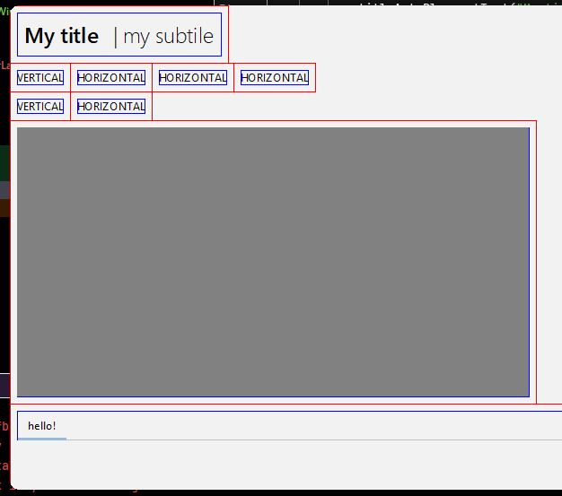

# Better-Layout [](https://jitpack.io/#Osiris-Team/Better-Layout)
Probably the best and most modern layout for Java AWT/Swing



```java
// ... window code not shown
BLayout rootLayout = new BLayout();
this.setContentPane(rootLayout);
rootLayout.isDebug = true;
rootLayout.access(() -> { // No need to call revalidate on any component inside here
    BLayout lyTitle = new BLayout(true); // true = crop to content
    rootLayout.addV(lyTitle);
    JLabel title = new JLabel(), subtitle = new JLabel();

    title.setText("My title");
    title.putClientProperty("FlatLaf.style", "font: 200% $semibold.font");
    lyTitle.addH(titleAutoPlug).paddingLeft();

    subtitle.setText("| my subtile");
    subtitle.putClientProperty("FlatLaf.style", "font: 200% $light.font");
    lyTitle.addH(titleTray).paddingLeft();
       
    rootLayout.addV(new JLabel("VERTICAL")); // Basically the same as "\n" in a string.
    rootLayout.addH(new JLabel("HORIZONTAL"), new JLabel("HORIZONTAL"), new JLabel("HORIZONTAL"));
    rootLayout.addV(new JLabel("VERTICAL"));
    rootLayout.addH(new JLabel("HORIZONTAL"));
    rootLayout.addV(new BLayout(rootLayout, 30, 30)); // 30% of parent width and height
    JTabbedPane tabbedPane = new JTabbedPane();
    tabbedPane.addTab("hello!", new BLayout());
    rootLayout.addV(tabbedPane);
});
```

### Features
- Compatible with all Java AWT/Swing components and containers.

#### Styles per component:
- Horizontal and Vertical positioning.
- Right, left, top and bottom padding.

#### Container methods for:
- Easy validation/revalidation of itself, parent and child containers via `access()` method.
- Easy addition of components vertically or horizontally via `addV()` and `addH()` methods.
